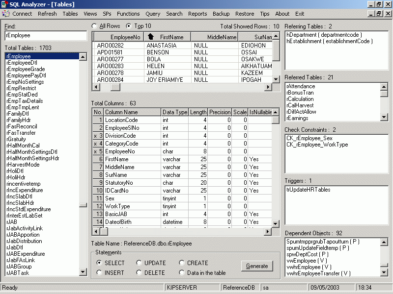



## SQL Analyzer

### Description

An easy to use tool for SQL Server developers, that I developed in VB. Makes working with a large number of database objects a pleasant job. Features include fast searching of db objects, displaying all their details, reporting, automatic code generation, fast backup and restore, etc among other user friendly options. Complete source code is provided.
 
### More Info
 
SQL Server and Excel must be installed

             |
---                |---
**Submitted On**   |2003-10-10 16:37:54
**By**             |[Sameer C T](https://github.com/Planet-Source-Code/PSCIndex/blob/master/ByAuthor/sameer-c-t.md)
**Level**          |Advanced
**User Rating**    |5.0 (110 globes from 22 users)
**Compatibility**  |VB 6\.0
**Category**       |[Databases/ Data Access/ DAO/ ADO](https://github.com/Planet-Source-Code/PSCIndex/blob/master/ByCategory/databases-data-access-dao-ado__1-6.md)
**World**          |[Visual Basic](https://github.com/Planet-Source-Code/PSCIndex/blob/master/ByWorld/visual-basic.md)
**Archive File**   |[SQL\_Analyz169091162004\.zip](https://github.com/Planet-Source-Code/sameer-c-t-sql-analyzer__1-50817/archive/master.zip)

### API Declarations

Everything included in the attached codes

